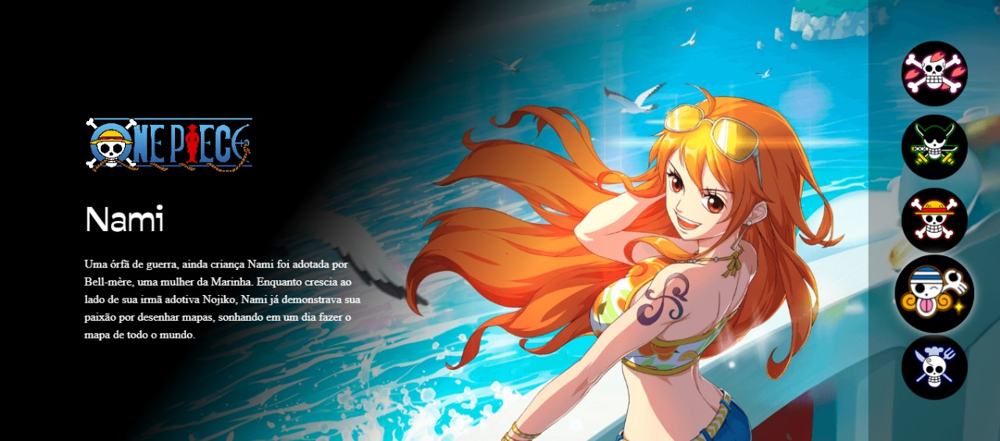

#  Projeto One Piece - Site Responsivo

Um site inspirado no universo de **One Piece**, criado com **HTML5**, **CSS3** e **JavaScript**, totalmente responsivo e com design estiloso. Ideal para treinar conceitos de responsividade, manipulação de DOM e estruturação de layout moderno.

 

---

##  Acesse o site online:

 [Clique aqui para ver o projeto no ar](https://erickao-120hzz.github.io/one-piece-site/)

---

##  Tecnologias Utilizadas

- HTML5
- CSS3 (com Reset de Estilo)
- JavaScript
- Responsividade com media queries

---

##  Funcionalidades

- Layout adaptável para celular, tablet e desktop
- Navegação com botões dinâmicos
- Interações com personagens e imagens
- Estrutura otimizada para portfólio

---

##  Como rodar localmente

`
git clone https://github.com/erickao-120hzz/one-piece-site.git
cd one-piece-site
abra o arquivo index.html no navegador`

## Aprendizados

Esse projeto foi um desafio de front-end pessoal para praticar:
Criação de páginas responsivas
Manipulação de classes no JS
Organização de código HTML/CSS
Uso de reset.css para manter consistência visual entre navegadores

---

##  Fala comigo!

Curtiu o projeto ou tem alguma ideia de melhoria? Me manda um e-mail ou me adicione no discord, vou gostar de ouvir!

 E-mail: **erickcarvalho661@hotmail.com**
 
 ---

 Discord: **erickzdv.exe**

---

##  Créditos
Feito com carinho por Erick (@erickao-120hzz)
Inspirado no mundo de One Piece, criado por Eiichiro Oda.

